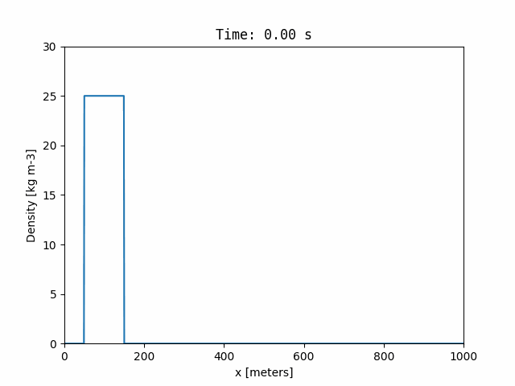

# fc-transport
One dimensional Flux-Corrected Transport fluid dynamics model.

### How to get this code
The code can be cloned from github using:

```
$ git clone https://github.com/raymenzel/fc-transport.git
$ cd fc-transport
```

### How to compile
This code is developed for linux.  The main program simulates the propagation of
a one-dimensional square wave by integrating the mass and momentum conservation equations
on a one-dimensional grid using the Flux-Correct Transport algorithm. It requires:

- A c compiler (preferably gcc)
- GNU make

To compile the code, simply use the provided Makefile:

```
$ make
```

This will create an executable called `square-wave`.


### How to run the code.
The executable can be run without any arguments:

```
$ ./square-wave
```

It will produce a csv file of density snapshots called `wave-output.csv`.
These snapshots can be turned into a gif with the provided `wave-animator`
python package. This simple package requires `matplotlib`.  To install it
in a virtual environment, run (if in bash):

```
$ python3 -m venv env
$ source env/bin/activate # if in bash
$ pip install ./wave-animator
```

The gif can be created by running `wave-animator` and passing in the `wave-output.csv`
as the first argument.

```
$ wave-animator wave-output.csv
```


